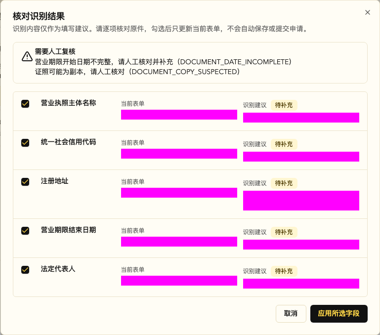

# 腾讯云 OCR 一期验收记录

## 1. 结论

- 代码实现、自动化测试、API/Admin 构建、数据库 migration 和远端只读审计通过。
- 远端 `TENCENT_OCR_ENABLED=false`，当前不会向租户 Admin 或小程序暴露识别能力。
- 已使用腾讯云官方演示营业执照和银行卡图片取得成功识别结果，并使用官方营业执照图片的模糊派生样本验证安全失败路径；经本人明确授权的身份证正反面样本也已完成加密识别。样例及识别字段值未写入仓库或验收记录，也未提交微信支付进件。
- 一期当前状态为“代码就绪，发布门禁未解除”，不能标记为生产可用。

未解除的发布门禁：

1. CAM 自定义策略的运行态最小权限探针已通过，但仍需安全负责人从控制台回读直接、用户组、
   继承策略和权限边界，确认没有额外 OCR 授权。
2. `OCR_RESULT_ENCRYPTION_KEY` 已按 development/production 环境分别配置，但生产 API 尚未发布密钥注入契约。
3. 小时级清理 workflow 已合入 main，但生产 API 尚未发布对应版本，仓库定时开关尚未配置，也没有生产运行证据。

身份证加密公钥已通过平台设置保存，且租户 API 正反面识别、结果密文存储、授权读取、幂等和
缓存链路均已通过。验收结束后总开关和身份证开关均恢复为 `false`，不对租户暴露能力。

## 2. 版本范围

实现分支：`feature/tencent-ocr-phase1`；发布基线已合入 `main`。

核心提交：

- `c3d606cd feat(db): 建立OCR识别记录`
- `324ef26d feat(ocr): 接入腾讯云识别网关`
- `81460ba6 feat(ocr): 编排租户证照识别`
- `26762386 feat(api): 提供OCR识别接口`
- `f40f49d9 feat(ocr): 清理过期识别结果`
- `8920b8bd feat(admin): 增加OCR配置与调用记录`
- `414ee922 feat(finance): 支持进件证照识别回填`
- `f582a550 fix(ocr): 按配置收敛可用能力`
- `899ac39a ci(ocr): 调度过期识别结果清理`
- `10a7501f fix(ci): 延后启用OCR清理调度`
- `a0f52aea fix(ocr): 默认关闭身份证加密识别`
- `1167a903 ci(ocr): 注入结果加密密钥`
- `cb09ab3b docs(ocr): 记录开发环境连通性验收`
- `e6e1e5c3 fix(ocr): 修复成功结果加密边界`
- `43f780b2 fix(ocr): 拒绝回填不完整证照日期`
- `3c681447 feat(ocr): 增加CAM最小权限预检`
- `6f72e839 security(ocr): 校验身份证加密公钥`
- `6ea9315e fix(db): 明确OCR加密公钥配置格式`
- `2b02775f fix(settings): 拒绝无效OCR加密公钥`
- `a94f1807 feat(admin): 增加OCR公钥专用配置`

## 3. 静态门禁

执行日期：2026-07-22（Asia/Shanghai）

| 检查                                                                  | 结果 | 证据                                        |
| --------------------------------------------------------------------- | ---- | ------------------------------------------- |
| Domain OCR 契约与权限                                                 | 通过 | 11 tests passed                             |
| API OCR、controller、repository、清理、进件 schema 和敏感存储聚焦回归 | 通过 | 95 tests passed                             |
| Admin OCR 配置/审计、进件回填和支付进件聚焦回归                       | 通过 | 35 tests passed                             |
| 生产清理调度契约                                                      | 通过 | 3 tests passed，YAML syntax ok              |
| API typecheck/build/file-size                                         | 通过 | Bun build 成功，文件大小检查通过            |
| Admin typecheck/file-size                                             | 通过 | Next typegen、TypeScript 和文件大小检查通过 |
| `git diff --check`                                                    | 通过 | 无空白错误                                  |

说明：API Bun 测试必须从 `apps/api` 目录运行，才能加载该包 `tsconfig` 中的 `@/` 别名；从仓库根目录直接传 API 文件路径会产生模块解析错误，不属于业务测试失败。

## 4. Migration 与远端只读审计

`supabase migration list --db-url "$SUPABASE_DB_DIRECT_URL"`：

- `20260722130000` Local：存在。
- `20260722130000` Remote：存在。
- `20260722150000` Local：存在。
- `20260722150000` Remote：存在。
- `20260722170000` Local：存在。
- `20260722170000` Remote：存在。
- `20260722180000` Local：存在。
- `20260722180000` Remote：存在。
- `20260722190000` Local：存在。
- `20260722190000` Remote：存在。
- Local/Remote：对齐。

通过 service-role REST 只读查询确认：

| 项目                                    | 结果                                      |
| --------------------------------------- | ----------------------------------------- |
| OCR 平台配置                            | 11 项 active                              |
| 敏感 OCR 配置                           | 3 项                                      |
| `ocr.recognize`                         | active                                    |
| `platform.ocr.recognition.read`         | active                                    |
| `TENCENT_OCR_ENABLED`                   | `false`                                   |
| `TENCENT_OCR_ID_CARD_ENCRYPTED_ENABLED` | `false`                                   |
| OCR 加密公钥                            | 已安全配置，不回显原文                    |
| `ocr_recognitions` 记录数               | 9（5 条成功、3 条失败、1 条过期清理审计） |

迁移源码同时定义并已随 migration 应用：强制 RLS、主键索引和 7 个显式索引、租户幂等
唯一索引、活跃结果去重索引、结果过期索引、平台文档类型筛选排序索引，以及无客户端 policy
的 service-role 访问边界。

`20260722150000` 是前向安全修正：仅当 OCR 总开关仍为 `false` 时，把全局身份证加密识别
能力收敛为 `false`。远端只读复核确认两个开关当前均为 `false`。

`20260722170000` 为平台分页审计的 `document_type + created_at DESC` 增加前向索引，避免按
文档类型筛选时随记录增长退化为全表扫描。

`20260722180000` 只更新平台级 `TENCENT_OCR_ENCRYPTION_PUBLIC_KEY_PEM` 的说明，明确 1024 位
PKCS#1 RSA PEM 和 Base64 解码要求，不修改 `value_text`。执行前 dry-run 只包含该 migration；
应用后全量 349 条 migration 的 Local/Remote 不一致数为 0。远端只读复核确认说明已更新、
`is_secret=true`、`is_configured=false`，因此未写入或覆盖任何公钥值。

`20260722190000` 只把帮助文案与 Admin 专用公钥编辑器对齐，不修改 `value_text`。Admin 支持
上传原始 PKCS#1 PEM，或粘贴完整 PEM 的外层 Base64；前端在提交前规范化，后端继续以
1024 位 PKCS#1 RSA 作为最终校验边界。应用后 Local/Remote 对齐，远端公钥仍为已配置状态。

## 5. 自动化场景证据

| 场景                                             | 结果 | 证据类型                   |
| ------------------------------------------------ | ---- | -------------------------- |
| 营业执照字段和有效期标准化                       | 通过 | normalizer test            |
| 模糊/复印件告警映射                              | 通过 | normalizer test            |
| 身份证正反面加密请求及响应解密                   | 通过 | gateway test               |
| 禁止身份证明文接口降级                           | 通过 | gateway test               |
| 银行卡字段和清晰度告警                           | 通过 | normalizer/gateway test    |
| 跨租户或无权文件拒绝                             | 通过 | service test               |
| 未绑定文件仅允许上传员工识别                     | 通过 | service test               |
| 未绑定结果仅允许原员工读取，业务结果复核进件权限 | 通过 | service test               |
| 幂等键重放不重复调用 provider                    | 通过 | service test               |
| 幂等键换请求复用返回 409                         | 通过 | service test               |
| 同文件同文档类型命中缓存                         | 通过 | service test               |
| 唯一键竞争只读取胜出记录                         | 通过 | service test               |
| 每日额度超限在 provider 前拒绝                   | 通过 | service test               |
| 结果加密不含身份证号/地址明文                    | 通过 | crypto test                |
| 过期结果拒绝解密并返回 410                       | 通过 | service test               |
| 进件敏感值继续走原加密保存                       | 通过 | sensitive integration test |
| OCR 关闭时能力列表为空                           | 通过 | service/controller test    |
| 结果加密密钥缺失时隐藏能力且不调用 provider      | 通过 | service test               |
| 身份证加密开关关闭时隐藏身份证能力               | 通过 | service test               |

## 6. Admin 交互证据

2026-07-22 在隔离 worktree 启动临时 API `127.0.0.1:3300` 和 Admin
`127.0.0.1:3310`，完成发布前只读 smoke。测试结束后关闭两个临时服务，不影响 main
工作区服务。

| 页面/接口                                          | 结果                                                                                               |
| -------------------------------------------------- | -------------------------------------------------------------------------------------------------- |
| `/settings?group=ocr`                              | 配置分组、总开关、身份证加密开关和配置测试入口可见；总开关和身份证开关均为关闭                     |
| `/platform/ocr`                                    | 分页审计页和空状态正常，未展示识别字段或文件地址                                                   |
| `/finance/wechat-pay/applyment`                    | 原手工填写表单可用；总开关关闭时不展示 OCR 操作，不阻断进件资料维护                                |
| `GET /ocr/capabilities?scene=wechat_pay_applyment` | HTTP 200；`data` 为长度 0 的数组；未包含 secret、token、证件号、银行卡号、signed URL 或 object key |

开发环境发布后只读复核：

- `18800000001 / 风清扬` 具备 `ocr.recognize`，能力接口返回 HTTP 200、能力数 0，符合总开关关闭的预期。
- `18800005001 / 小龙女` 不具备 `ocr.recognize`，能力接口返回 HTTP 403 `FORBIDDEN`；这是权限边界，不是 OCR 服务故障。

最终三页面浏览器复测未发现 console error 或接口 4xx/5xx。全过程未调用识别接口、未上传
证件、未创建识别记录、未保存或提交微信支付进件，也未推进 workflow。

自动化源码契约和类型检查确认：

- 平台系统配置包含“腾讯云 OCR”分组；SecretId/SecretKey 使用密码遮罩控件，加密公钥使用
  不回显原文的专用 PEM/Base64 编辑器。
- 配置测试只接受 2MB 内 JPEG/PNG，调用前要求确认图片授权并提示可能计费。
- 配置测试只展示状态、RequestId、耗时和 warning code，不展示识别字段。
- `/platform/ocr` 使用后端 `page/pageSize` 分页，不在前端对当前页做总量过滤。
- 平台列表不渲染识别字段值、文件对象 ID、图片 URL 或 signed URL。
- 进件附件只接受 JPEG/PNG，并持久化 `file_object_id`。
- 识别结果弹窗按“空值默认选中、相同默认不选、有差异默认不选”处理。
- 经办人身份证字段映射到经办人/超级管理员字段，不覆盖法人字段。
- “应用所选字段”只更新当前表单；没有 create、update、submit 或 workflow 调用。

发布后已使用腾讯官方营业执照演示图片完成真实上传、识别、差异弹窗和选择回填浏览器验证，
证据见 6.4 节。验证只更新浏览器内存中的表单状态，未保存草稿、未提交正式微信进件，也未触发
workflow。

### 6.1 开发环境密钥与合成图连通性验证

2026-07-22 后续门禁推进结果：

- 本地受控环境已存在独立的 `TENCENT_OCR_SECRET_ID/SECRET_KEY`；只核验变量存在性和长度，未输出密钥值。
- 两项密钥已通过平台设置接口写入开发环境加密配置；总开关和身份证加密开关继续保持 `false`。
- 官方 Node SDK 使用 1×1 空白 PNG 分别调用 `BizLicenseOCR` 和 `BankCardOCR`，两次均取得腾讯 RequestId，并返回 `FailedOperation.OcrFailed`；没有鉴权或无权限错误，证明凭证和两个 Action 可达。
- 同一凭据使用空白 PNG 探测一期范围外的 `GeneralBasicOCR`，取得腾讯 RequestId 并返回 `FailedOperation.ImageDecodeFailed`，而非 CAM 无权限错误。这直接证明当前凭据权限过宽，不能作为一期生产凭据。仓库已增加 `deploy/tencent-ocr-phase1-cam-policy.json` 和自动契约测试，要求替换为只允许三个一期 Action 的独立 CAM 子用户凭据。
- 使用 ImageMagick 生成带“仅用于 OCR 联调、非真实证照”标识的合成营业执照 PNG。腾讯返回 `FailedOperation.NoBizLicense`，符合该图片不是真实证照的预期；该图片不包含真实主体或个人信息。
- development 与 production GitHub Environment 已分别创建独立的 `OCR_RESULT_ENCRYPTION_KEY`，值未写入仓库、数据库、日志或文档。
- 提交 `7caa0fc5` 为开发/生产 API Compose 增加必填密钥，并由对应 Environment secret 注入发布 workflow；缺少密钥时发布在容器重建前失败关闭。
- 开发 API 通过受控 `Release Dev` run `29900583442` 发布成功，commit 为 `7caa0fc5`；构建、migration 历史校验、Compose 重建和健康检查均通过。
- 发布后仅在脚本 `try/finally` 范围内临时开启总开关，调用 `/platform/ocr/config-test` 识别上述合成图；接口返回 HTTP 502 `OCR_PROVIDER_FAILED` 且包含 provider RequestId，证明开发 API 已使用平台加密配置访问腾讯 OCR。测试接口不保存图片或识别字段。
- `finally` 关闭后只读复核：`TENCENT_OCR_ENABLED=false`、租户能力数 0、平台识别审计总数 0。
- 部署契约随后合入 `main@cb09ab3b`。主线 Build run `29901320353` 和 Auto Deploy Dev run `29901617304` 均成功，API、workers、Web 发布及 Web gate 全部通过。
- 主线自动部署后再次只读复核：开发 API 健康检查 HTTP 200；OCR SecretId/SecretKey 均显示已配置；`TENCENT_OCR_ENABLED=false`、`TENCENT_OCR_ID_CARD_ENCRYPTED_ENABLED=false`、租户能力数 0、平台识别审计总数 0。未执行识别、上传、回填或 workflow 推进。

该证据解除“凭证完全未配置”和“开发 API 结果密钥未注入”门禁，但同时确认 CAM 最小权限
尚未达标；它不等同于有效证照识别成功，也不证明字段差异回填、加密身份证或生产清理调度
可用。

### 6.2 开发环境上传、幂等与租户隔离负向 Smoke

2026-07-22 使用明确标注“测试样本、仅用于 OCR 联调、非真实证照”的合成 PNG 执行。图片不含
真实主体、证件号码、银行卡号或个人信息；未提交微信支付进件。识别操作租户为
`5f9404fd-23a7-4686-a606-b2627a65611d`，跨租户文件归属
`3eebca47-961f-4899-b976-a3d3208d326b`。

| 检查                                    | 结果                                                                                                                                                 |
| --------------------------------------- | ---------------------------------------------------------------------------------------------------------------------------------------------------- |
| COS direct-init / PUT / direct-complete | 通过；`file_id=c7e32f3c-2958-417d-addf-55722d3256a2`                                                                                                 |
| 首次 `POST /ocr/recognitions`           | HTTP 502 `OCR_PROVIDER_FAILED`；腾讯返回 `FailedOperation.NoBizLicense`，符合非真实证照预期                                                          |
| 失败审计                                | 新增 `recognition_id=cef862f9-ab7f-482e-8d37-3d949f2618cc`，状态 `failed`，provider RequestId `8108d51e-38f3-4979-856d-aae6b6b7c8c5`，未保存识别字段 |
| 原请求与原幂等键重放                    | HTTP 200；返回同一 recognition，`idempotent=true`、`cached=false`，未再次调用 provider                                                               |
| 同幂等键更换文档类型                    | HTTP 409 `OCR_IDEMPOTENCY_CONFLICT`                                                                                                                  |
| 默认日额度负向探针                      | 临时设置日额度为 1 后返回 HTTP 429 `OCR_DAILY_LIMIT_EXCEEDED`；审计总数不变，未调用 provider                                                         |
| 跨租户文件 ID 识别                      | HTTP 404 `OCR_FILE_NOT_FOUND`；审计总数不变，未调用 provider                                                                                         |
| 本租户读取失败记录                      | HTTP 200，状态 `failed`                                                                                                                              |
| 其他租户读取该 recognition              | HTTP 404 `OCR_RECOGNITION_NOT_FOUND`                                                                                                                 |
| 平台分页失败审计                        | HTTP 200、`total=1`；响应未包含结果密文、object key、signed/image URL、识别字段值或合成图文字                                                        |
| 测试结束状态                            | `TENCENT_OCR_ENABLED=false`；能力数 0；新识别返回 503 `OCR_DISABLED`；审计总数由 0 变为 1，只有上述合成图失败记录                                    |

开关修改均在脚本 `try/finally` 内执行。跨租户文件探针使用另一租户已有文件 ID，但后端在
tenant-scoped 文件查询处即返回 404，因此没有读取文件内容、生成 signed URL 或进入腾讯 OCR。
日额度探针把 `TENCENT_OCR_DEFAULT_TENANT_DAILY_LIMIT` 从 100 临时调整为 1，验证 429 后恢复为
100；该请求没有创建第二条识别记录。
本节证明上传登记、provider 失败审计、幂等重放、幂等冲突和租户隔离的开发环境运行态契约；
不证明成功结果加密/解密、成功结果缓存、真实字段识别或 Admin 差异回填。

### 6.3 官方演示样例成功链路与模糊样例回退

2026-07-22 使用腾讯云官方 API 文档提供的演示图片继续执行开发环境 smoke：

- 营业执照来源：<https://cloud.tencent.com/document/api/866/36215>；本地临时下载文件
  SHA-256 为 `d6af048cb3d31e3ccd21a3acbfd86188a40a61126c6d53c61b36f7c2f3f3a05b`。
- 银行卡来源：<https://cloud.tencent.com/document/api/866/36216>；本地临时下载文件
  SHA-256 为 `18e7b76c8010b389fc92ab3f4952d870c7e8f95dffb8a672226e111a0de61317`。
- 模糊营业执照由上述官方营业执照临时文件执行 ImageMagick 高斯模糊 `0x8` 生成，
  SHA-256 为 `864896f32383a76d2c9050d430883037bd0a55cf573e8b262369c8fc20b35cd2`。
- 三张图片均只保存在 `/tmp`，未加入 Git；以下只记录字段 key、计数和安全审计元数据，
  不记录 COS URL、object key 或任何识别字段值。

首次通过完整 API 链路调用官方营业执照样例时，腾讯 provider 已返回成功，但后端返回
`OCR_RESULT_INVALID`。根因是 `normalizeOcrResponse` 的返回对象同时包含业务结果和
`providerRequestId`，服务把整个对象传入严格的 `OcrNormalizedResultSchema` 加密校验，导致
provider 元数据被误判为非法业务字段。该次失败审计为
`bd2ffd57-987a-4d6e-ac4e-99d165e3956b`，未保存结果密文或字段值。

提交 `e6e1e5c3` 将 `providerRequestId` 从加密输入中分离，并新增单测锁定加密边界。聚焦 OCR
及进件安全回归共 75 项通过，API typecheck、build 和文件大小检查通过。开发镜像 build run
`29906279526` 与 API deploy run `29906490565` 均成功，精确发布 commit 为 `e6e1e5c3`。
自动发布和完整 Release Dev 工作流当时处于手工关闭状态，因此使用活动的
`Build Docker Images` 与 `Deploy Dev` 工作流完成不可变镜像发布；一次直接复用 push build
证据的 deploy run `29906094190` 被证据校验按设计拒绝，没有更新运行服务。

| 场景                 | 脱敏结果                                                                                                                                                                                                                              |
| -------------------- | ------------------------------------------------------------------------------------------------------------------------------------------------------------------------------------------------------------------------------------- |
| 官方营业执照成功识别 | `file_id=d37a120e-376f-4196-bdfc-c7d15a836dca`；`recognition_id=cf8cbf8b-b3c5-4057-974a-83449061f2d4`；RequestId `7b9675c2-d97e-492b-b9d6-9a5b2e217098`；HTTP 200、`succeeded`                                                        |
| 营业执照稳定字段     | 6 个 key：`license_name`、`license_code`、`license_address`、`license_period_begin`、`license_period_end`、`legal_representative_name`；warning 为 `DOCUMENT_COPY_SUSPECTED`                                                          |
| 成功结果加密和读取   | 数据库密文长度 1410；`result_summary` 仅含 `field_keys`、`sensitive_field_count`、`warning_codes`；API 解密读取字段数仍为 6；密文和摘要均不含识别字段明文                                                                             |
| 幂等重放             | 原幂等键返回同一 recognition，`idempotent=true`、`cached=false`；未新增审计                                                                                                                                                           |
| 成功缓存             | 同文件、同类型、新幂等键返回同一 recognition，`idempotent=false`、`cached=true`；未新增审计                                                                                                                                           |
| 官方银行卡成功识别   | `file_id=af124df9-347f-4e70-844a-a24d2706fc8d`；`recognition_id=ad1285fe-470e-4856-8a47-154d127bac80`；RequestId `176a89f0-987f-4fe4-ad36-a7743018d4c3`；HTTP 200、`succeeded`                                                        |
| 银行卡稳定字段       | 3 个 key：`settlement_account_number`、`settlement_bank_name`、`settlement_card_type`；无 warning                                                                                                                                     |
| 银行卡加密存储       | 数据库密文长度 669；安全摘要结构正确，密文和摘要不含识别字段明文；`billable_units=1`                                                                                                                                                  |
| 模糊营业执照回退     | `file_id=28037bca-07d3-47bd-be3c-1f91fa5e415d`；`recognition_id=8fd32180-0f86-4b68-878f-8fcb84540048`；RequestId `a06bf949-562c-4dfb-adbd-9bf15aa067d9`；HTTP 502 `OCR_PROVIDER_FAILED`，provider code `FailedOperation.NoBizLicense` |
| 模糊样例安全存储     | 状态 `failed`，字段数 0、无密文、`billable_units=0`；客户端应保留原表单并提示重拍或手工录入，不得自动回填                                                                                                                             |
| 审计与关闭状态       | 三个新场景使审计总数从 2 增至 5；每个 provider 首次调用只增加一条记录。全部脚本 `finally` 后 `TENCENT_OCR_ENABLED=false`，租户能力数为 0                                                                                              |

本节解除营业执照、银行卡、成功结果加密/解密、成功缓存和模糊样例安全回退的运行态门禁。
仍未完成加密身份证正反面验收；CAM 凭据也仍需收敛到仓库策略后才能作为生产凭据。Admin
差异弹窗和选择回填已在后续日期规范修复发布后完成，见 6.4 节。

### 6.4 不完整证照日期防护与 Admin 字段复核

腾讯官方营业执照演示图片的营业期限开始值可能只包含年月。原 normalizer 会把该原始值标记为
已标准化，Admin 的 HTML 日期控件随后拒绝显示，形成“识别成功但日期无法可靠回填”的契约
缺口。提交 `43f780b2` 改为只接受完整且有效的日期；不完整日期不进入稳定字段，也不推测日期，
同时返回 `DOCUMENT_DATE_INCOMPLETE` warning。聚焦 OCR 与进件回归 76 项通过，API typecheck、
build 和文件大小检查通过。

开发镜像 build run `29908198534` 和 Auto Deploy Dev run `29908494301` 均成功，精确发布
commit 为 `43f780b206181801f347222f3d50238da88eb39d`。发布后使用腾讯官方营业执照演示图片的重新
编码副本执行全链路复测，临时文件 SHA-256 为
`01eca8a84722f47dc451bfd4e6a9b053a6c90637099c0fa61770a8c4e7e6c841`，未加入 Git。

| 检查           | 脱敏结果                                                                                                                                                                       |
| -------------- | ------------------------------------------------------------------------------------------------------------------------------------------------------------------------------ |
| API 成功识别   | `file_id=958792b3-1c51-463d-81ea-6b641b9b1d3e`；`recognition_id=0a9919e9-12ab-4448-abf4-7d70b12d5641`；RequestId `58482581-bc6a-443a-af09-1dc63ddfdde1`；HTTP 200、`succeeded` |
| 日期防护       | 返回 5 个稳定字段 key，未包含 `license_period_begin`；warning 为 `DOCUMENT_DATE_INCOMPLETE`、`DOCUMENT_COPY_SUSPECTED`；没有补造日期                                           |
| 安全存储       | 成功结果有密文，`billable_units=1`；文档不记录识别字段值、COS URL、object key 或 signed URL                                                                                    |
| 审计变化       | 首次 provider 调用使审计总数从 5 增至 6；测试结束后 `TENCENT_OCR_ENABLED=false`、租户能力数 0                                                                                  |
| Admin 字段复核 | 复核弹窗显示上述 5 个字段且默认选中；两个 warning 均可见；点击“应用所选字段”后 5 个建议值均进入当前表单                                                                        |
| 写操作边界     | Admin UI 复测命中成功缓存，审计保持 6；没有保存草稿、提交进件或调用 workflow                                                                                                   |

截图已遮盖当前值和识别建议值，只保留字段标签、warning 和交互状态。浏览器复测没有 API
4xx/5xx；COS 直传首次请求存在开发域名 CORS console error，但现有
`/api/uploads/cos/direct-proxy` 回退成功，因此上传和识别链路可用。使用项目已安装的
`cos-nodejs-sdk-v5` 只读检查确认，存储桶允许生产 Admin 和小程序来源，但未允许
`https://admin-dev.goodcms.cn`。本轮没有修改远端 COS；如需消除回退和 console error，须经
基础设施变更确认后为开发域名增加精确 CORS origin，不能放宽为通配来源。

### 6.5 CAM 最小权限运行态预检

提交 `3c681447` 增加 `bun run ocr:cam:readiness`。命令使用仓库锁定版本的腾讯云 OCR SDK，
以嵌入的 1×1 空白 PNG 顺序探测三个一期 Action 和一个明确排除的 `GeneralBasicOCR`。它不读取
业务文件、不保存识别结果，只输出 Action、期望、判定、provider code 和 RequestId；凭据、
请求体及 provider message 均不输出。四个判定场景单测通过，API typecheck、build 和文件大小
检查通过。

后续门禁加固把默认凭据来源改为平台系统设置数据库 active 记录，缺失时不回退环境变量；只有
显式 `--source=environment` 才读取环境变量。同时在 client 创建前固定校验腾讯官方 endpoint，
并把限流和未知错误等非图片/参数校验错误排除出正向证据。输出新增 `credential_source`、
`official_endpoint`、`runtime_probe_ready`、`encrypted_id_probe_payload_valid`、
`policy_binding_verified` 和 `production_ready`，避免把单一负向 Action 探针误当成完整 CAM
策略审计。身份证预检改为使用平台配置公钥生成符合生产协议的 AES-256-CBC + RSA PKCS#1
加密空白图请求，不读取真实证件，并校验探针的 AES/RSA 密文、IV 和加密字段结构。11 项聚焦
测试、API typecheck、build 和文件大小检查通过。

2026-07-22 使用平台系统设置中的当前生效凭据执行，命令按设计退出 1，脱敏结果如下：

| Action                        | 期望 | 实际                                | RequestId                              | 判定                             |
| ----------------------------- | ---- | ----------------------------------- | -------------------------------------- | -------------------------------- |
| `BizLicenseOCR`               | 允许 | `FailedOperation.ImageDecodeFailed` | `cc0deaad-ef69-4b62-8360-d85141642baf` | 通过，已到达业务校验             |
| `BankCardOCR`                 | 允许 | `FailedOperation.ImageDecodeFailed` | `2a483bd1-4cd2-4f6f-bc65-52ba199dddbe` | 通过，已到达业务校验             |
| `RecognizeEncryptedIDCardOCR` | 允许 | `FailedOperation.ImageDecodeFailed` | `b2355c3f-f9d1-4c7b-a98f-f67e94dcfd43` | 通过，加密请求已到达图片校验     |
| `GeneralBasicOCR`             | 拒绝 | `FailedOperation.ImageDecodeFailed` | `950742cf-22ed-42b3-883a-30287dee5527` | 失败，范围外 Action 仍然可以调用 |

结论：本次默认来源为 `platform_settings`，`official_endpoint=true`、
`encrypted_id_probe_payload_valid=true`，三个一期 Action 均通过行为探针；但
`runtime_probe_ready=false`、`ready=false`、`policy_binding_verified=false`、
`production_ready=false`。当前凭据可继续用于隔离开发环境排查，但不能作为一期生产凭据。平台安全
管理员创建只绑定 `deploy/tencent-ocr-phase1-cam-policy.json` 的独立 CAM 子用户并替换密钥后，
必须重新运行该命令，且只有三个目标 Action 通过、`GeneralBasicOCR` 返回权限拒绝时才能解除
门禁。

随后操作者确认已把当前 CAM 权限改为自定义策略，并于 2026-07-22 再次使用平台系统设置中的
生效凭据执行。命令退出 0，脱敏结果如下：

| Action                        | 期望 | 实际                                | RequestId                              | 判定                         |
| ----------------------------- | ---- | ----------------------------------- | -------------------------------------- | ---------------------------- |
| `BizLicenseOCR`               | 允许 | `FailedOperation.ImageDecodeFailed` | `e0245206-c640-4de5-944d-9febee75c323` | 通过，已到达业务校验         |
| `BankCardOCR`                 | 允许 | `FailedOperation.ImageDecodeFailed` | `f1dcc494-e1b2-4aea-9ae4-65981b3a4e47` | 通过，已到达业务校验         |
| `RecognizeEncryptedIDCardOCR` | 允许 | `FailedOperation.ImageDecodeFailed` | `51bc6069-1daa-4ef7-914e-99ab40314e67` | 通过，加密请求已到达图片校验 |
| `GeneralBasicOCR`             | 拒绝 | `AuthFailure.UnauthorizedOperation` | `0ef012ff-b106-4546-88d9-0a5cdba12f12` | 通过，范围外 Action 已拒绝   |

最新结论：`credential_source=platform_settings`、`official_endpoint=true`、
`encrypted_id_probe_payload_valid=true`、`runtime_probe_ready=true`、`ready=true`。这证明当前
运行凭据满足三个目标 Action 允许、范围外 Action 拒绝的行为门禁。输出仍按设计保留
`policy_binding_verified=false` 和 `production_ready=false`；安全负责人仍需从 CAM 控制台回读
直接、用户组、继承策略和权限边界，行为探针不能单独证明不存在其他额外 OCR Action。

同日使用腾讯云官方 CAM Node SDK `4.1.265` 进行了只读权限审计。`GetUserAppId` 成功，确认当前
SecretId 属于 CAM 子账号，RequestId 为 `e359d784-abb2-4750-9f5d-b19cb633da70`；继续调用
`ListAttachedUserAllPolicies` 时返回 `AuthFailure.UnauthorizedOperation`，RequestId 为
`35777361-7d4e-4b5a-b5fe-c0e519a83aa3`。审计没有输出完整 UIN、AppId、SecretId 或 SecretKey，
也没有执行 `AddUser`、`CreatePolicy`、`AttachUserPolicy` 等写操作。该结果说明现有 OCR
凭据不能自助完成 CAM 收敛，必须由主账号或独立 CAM 管理员创建替代子账号。

### 6.6 身份证加密公钥格式门禁

腾讯云官方敏感数据加密指引确认，加密公钥需由腾讯 OCR 提供；官方 Demo 可以联系售后获取，
但文档同时提供完整的无 SDK 实现协议，因此 Demo 不是发布硬门禁。该公钥不是项目自行生成的
KMS 密钥，也不能用其他腾讯云产品公钥替代。提交 `6f72e839` 增加公钥格式校验和双层失败关闭：

- 后端只接受规范化后的 1024 位 PKCS#1 RSA public key PEM；Admin 专用编辑器可接收完整
  PEM 的外层 Base64 并在提交前规范化。SPKI/PKCS#8、错误位数和畸形值仍拒绝。
- 能力开关开启但公钥无效或缺失时，`/ocr/capabilities` 不返回身份证正反面能力。
- gateway 在调用 `RecognizeEncryptedIDCardOCR` 前再次校验，不降级到明文身份证接口。
- Admin 专用编辑器明确提示支持原始 PEM 和完整 PEM 的外层 Base64，并在本地规范化后提交。
- 系统设置保存层在加密和数据库写入前拒绝无效值并返回中文 400；错误信息不回显提交内容，
  空值仍可用于清除未配置公钥。

公钥格式、配置能力过滤、gateway 防御和设置保存共 34 项聚焦测试通过，API typecheck、build 和文件
大小检查通过。该提交只完成代码门禁，不代表完成真实身份证识别；身份证能力继续保持关闭。

### 6.7 身份证加密协议受控探针

2026-07-22 对腾讯 OCR 提供的 Base64 包裹公钥做了只读、内存内验证，未把公钥写入仓库、
数据库或日志：

- 外层 Base64 解码成功，内容为 1024 位 PKCS#1 RSA public key PEM。
- 公钥 DER 的 SHA-256 指纹为
  `63350c29ad1c5d2736f041dbed79428a47666f2e7d3055472d7908af12cc1c30`，后续保存或轮换时用该
  指纹核对材料，文档不记录公钥正文。
- 仓库实现逐项符合官方方式二：每次请求随机生成 32 字节 AES key 和 16 字节 IV，使用
  AES-256-CBC/PKCS#7 加密 `EncryptedBody`，使用 RSA PKCS#1 v1.5 加密 AES key，并使用同一
  AES key/IV 解密响应。
- 加密公钥、gateway 和 SDK 兼容性聚焦测试 8 项通过。
- 在不修改平台设置和开关的情况下，以内存注入公钥、1x1 空白 PNG 调用
  `RecognizeEncryptedIDCardOCR`。腾讯返回 `FailedOperation.ImageDecodeFailed` 和 RequestId
  `085f7df7-1b1c-46b0-b4cc-b924c7bb9180`，没有返回鉴权、密钥格式、算法或密文解密错误。

该结果证明腾讯服务端已接受并解密请求体，Node.js Demo 不再是第 2 项的阻塞条件。

随后使用本人明确授权的身份证正反面照片执行真实加密识别，图片只从本地读取并放入本次请求
内存，没有复制到仓库、上传 COS 或写入数据库；终端和本文档均未输出识别字段明文：

| 卡面  | 结果 | 脱敏字段检查                       | warning 数 | 腾讯 RequestId                         |
| ----- | ---- | ---------------------------------- | ---------- | -------------------------------------- |
| FRONT | 成功 | 姓名、证件号、地址、出生日期均存在 | 0          | `e1b3c9cd-d1d4-4797-96aa-7dab8f7de1d0` |
| BACK  | 成功 | 签发机关、有效期均存在             | 0          | `d097eb4f-efa2-45b7-9385-9b1f863f8bf5` |

真实样本证明请求加密、腾讯侧解密识别、加密响应返回和 Node.js 响应解密链路均通过。

随后把同一公钥通过平台设置安全保存，并复用租户现有微信支付申请中本人授权的身份证附件，
在 development API 上完成租户 API 全链路。测试没有新增或修改进件、没有提交微信进件，也
没有再次上传或复制证件图片。开关修改置于退出清理中，结束后只读复核均为 `false`。

| 检查       | 脱敏结果                                                                                                                                                    |
| ---------- | ----------------------------------------------------------------------------------------------------------------------------------------------------------- |
| 能力暴露   | 短时开启期间 `/ocr/capabilities` 返回一期 4 项能力；关闭后恢复为 0                                                                                          |
| 人像面     | `recognition_id=0f1b49d2-010a-4347-b6c2-95a2a0c50c55`；RequestId `30fbe42f-c1ed-453d-845c-f2e19a21f898`；HTTP 200、`succeeded`、3 个预期字段 key、warning 0 |
| 国徽面     | `recognition_id=d3e8c24b-3769-41b0-bafc-26b8e87c17c3`；RequestId `2a49ada3-df25-457a-8933-029507566cf5`；HTTP 200、`succeeded`、3 个预期字段 key、warning 0 |
| 幂等与缓存 | 原幂等键重放命中同一人像面记录且 `idempotent=true`；新幂等键命中同一记录且 `cached=true`                                                                    |
| 授权读取   | 两条 `GET /ocr/recognitions/:id` 均为 HTTP 200，字段 key 完整                                                                                               |
| 密文存储   | 两条记录均有结果密文；密文长度分别为 682、678；摘要仅含 `field_keys`、`sensitive_field_count`、`warning_codes`                                              |
| 明文边界   | 内存比对 6 个识别值，均未出现在 `result_ciphertext` 或 `result_summary` 中；字段值未输出到终端或文档                                                        |
| 计费与时延 | 两条记录 `billable_units=1`；时延分别为 1414ms、1133ms                                                                                                      |
| 关闭状态   | `TENCENT_OCR_ENABLED=false`、`TENCENT_OCR_ID_CARD_ENCRYPTED_ENABLED=false`，能力数 0                                                                        |

身份证接口协议、平台公钥保存和租户 API 运行态门禁均已解除。结果过期与 410 读取边界已由第
7 节独立夹具验证；生产定时清理和 CAM 最小权限仍是发布阻塞项。

## 7. 清理任务证据

2026-07-22 已先对目标数据库执行空候选命令验证：

- dry-run：成功，候选 0，更新 0。
- apply：成功，候选 0，更新 0。

随后使用已验证官方样例对应的测试文件元数据创建一条明确标记、零计费、不含识别字段的临时
成功记录，执行真实过期清理：

| 检查           | 脱敏结果                                                                                              |
| -------------- | ----------------------------------------------------------------------------------------------------- |
| 夹具           | `recognition_id=332d424d-c02b-45f8-a8b9-5dd5abacdea3`；`billable_units=0`；密文为固定非敏感测试字符串 |
| 执行前         | dry-run `candidate_count=0`                                                                           |
| 创建过期夹具后 | dry-run `candidate_count=1`，满足唯一候选保护条件                                                     |
| apply          | `candidate_count=1`、`expired_count=1`                                                                |
| 数据状态       | `status=expired`、`result_ciphertext IS NULL`                                                         |
| 执行后         | dry-run `candidate_count=0`                                                                           |
| 租户读取       | HTTP 410 `OCR_RECOGNITION_EXPIRED`                                                                    |

开发环境真实过期清理和 410 读取边界已通过，脱敏过期审计记录按设计保留，当前总审计数为 9。
该结果仍不替代生产 API 镜像、小时级调度器和连续运行证据。

生产调度定义已增加到 `.github/workflows/ocr-result-cleanup.yml`：每小时第 17 分钟执行、
10 分钟超时、固定 concurrency 防止并行、复用健康的生产 API 容器。apply 在一个任务内按
500 条一批连续处理，最多执行 20 批；超过 10,000 条仍有积压时失败告警，并保存 30 天脱敏
artifact。定时事件还要求仓库变量
`OCR_CLEANUP_SCHEDULE_ENABLED=true`，避免 workflow 先于生产 API 镜像发布而产生误报。该
workflow 已合入默认分支，但生产 API 最新成功发布仍是 GitHub Actions run `29670449440`
（commit `d47f04ed`），早于 OCR 代码合入。生产 Environment 已存在
`OCR_RESULT_ENCRYPTION_KEY` secret，但尚未配置 `OCR_CLEANUP_SCHEDULE_ENABLED` 变量。清理
workflow 已有两次定时事件记录：run `29908754780` 和 `29918045961` 均为 `skipped`，符合变量
关闭门禁，不能作为清理执行证据。在生产 API 发布包含清理脚本的版本前，不应手工触发已知会
被脚本存在性门禁拒绝的任务，也不能把源码契约或 skipped run 当作生产连续运行证据。

## 8. 真实腾讯云 Smoke 待办

准备条件满足后，按顺序执行并在本文件追加脱敏证据：

1. 部分完成：操作者已把当前 CAM 权限改为自定义策略，`bun run ocr:cam:readiness` 最新返回
   `ready=true`；仍需安全负责人回读 CAM 控制台中的直接、用户组、继承策略和权限边界，并提供
   脱敏证据后，才能把策略绑定审计标记完成。
2. 已完成：取得 1024 位 PKCS#1 RSA 加密公钥，完成格式校验、平台安全保存、无真实证件受控
   请求、本人授权身份证正反面成功响应解密和租户 API 密文存储/读取。Node.js Demo 不再作为
   硬门禁；API 部署环境的 `OCR_RESULT_ENCRYPTION_KEY` 不得写入数据库、文档或截图。
3. 部署包含清理脚本的 API 镜像，执行一次手工 dry-run、一次手工 apply
   和至少一次小时级定时 run，回填 run ID 与脱敏 artifact。
4. 已完成：保持身份证开关关闭，执行腾讯官方营业执照正常样例和模糊派生样例；总开关已恢复关闭。
5. 已完成：腾讯身份证加密接口正反面直连、租户 API 识别、结果加密存储、授权读取、幂等和
   缓存均已通过；过期清理和 410 读取边界已由独立夹具验证。验收结束后两个开关均恢复关闭。
6. 已完成：腾讯官方银行卡样例、跨租户、幂等、缓存和额度负向场景均已执行；总开关已恢复关闭。
7. 部分完成：租户 Admin 上传、识别、逐字段确认和选择回填已通过；没有保存草稿或提交正式微信进件。若发布门禁要求持久化验证，使用专用测试进件完成手工修改和保存草稿后立即清理，禁止提交正式微信进件。
8. 回填 recognition ID、脱敏 tenant ID、document type、status、duration、RequestId、warning code、HTTP 状态及脱敏截图；禁止记录图片、signed URL 和字段明文。

## 9. 发布判定

当前判定：`NO-GO`。

解除条件：第 8 节真实腾讯云 Smoke 全部通过，生产小时级清理调度连续运行证据完成，并由平台技术负责人和安全负责人共同确认。解除前保持 `TENCENT_OCR_ENABLED=false`，原微信支付进件手工填写与保存链路不受影响。
